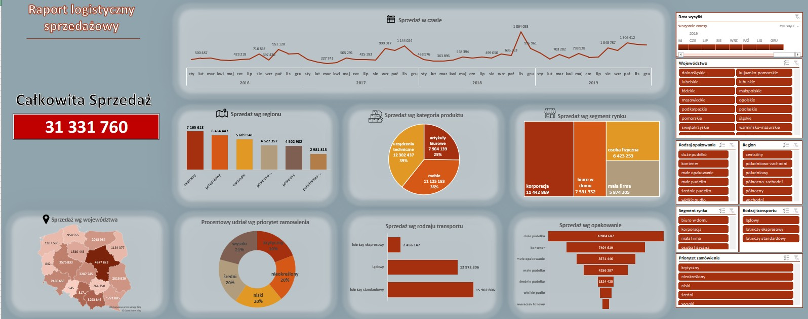

# Excel Projects

📦 **Raport logistyczno-sprzedażowy**

Interaktywny dashboard analityczny wykonany w Excelu, prezentujący dane sprzedażowe i logistyczne w ujęciu czasowym, regionalnym i produktowym.  
Projekt zrealizowany w ramach studiów – stanowi kompleksową analizę obszarów wpływających na efektywność sprzedaży i dystrybucji.

---

## 🎯 Cel projektu

Celem raportu było opracowanie zintegrowanej analizy sprzedaży z wykorzystaniem narzędzi Excela, pozwalającej na identyfikację kluczowych czynników wpływających na wyniki, sezonowość oraz efektywność dostaw i kanałów sprzedaży.

---

## 🔍 Zakres analizy

- Analiza sprzedaży w czasie (trendy roczne, sezonowość)  
- Sprzedaż według regionu i województwa  
- Struktura sprzedaży wg kategorii produktów  
- Analiza segmentów klientów (korporacje, MŚP, osoby fizyczne)  
- Udział priorytetów zamówień i rodzajów transportu  
- Sprzedaż wg typu opakowania i kanału dystrybucji  

---

## 🧰 Zastosowane narzędzia i techniki

- **Power Query** – podstawowe przygotowanie i porządkowanie danych przed analizą  
- **Tabele przestawne i wykresy dynamiczne** – interaktywna wizualizacja danych  
- **Formuły warunkowe i niestandardowe formatowanie** – automatyzacja analizy i poprawa czytelności raportu  
- **Segmentatory** – filtrowanie po regionie, produkcie, okresie i rodzaju transportu  

---

## 📊 Podgląd raportu

