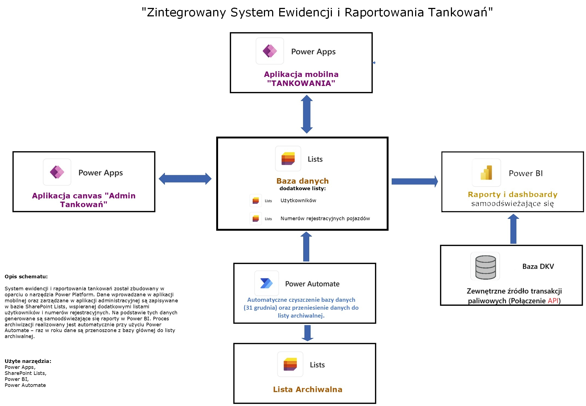

# 📘 Power Apps Projects

Zestaw aplikacji biznesowych stworzonych w ramach ekosystemu **Microsoft Power Platform**, z wykorzystaniem **Power Apps**, **Power Automate**, **SharePoint Lists**, **Dataverse** oraz **Power BI**.  
Projekty zostały opracowane w celu usprawnienia procesów raportowania, administracji i analizy danych w organizacji.

---

## 🚗 Aplikacja do monitorowania floty pojazdów

Aplikacja mobilna umożliwiająca:
- rejestrację tankowań i przebiegów,  
- kontrolę kosztów paliwa,  
- wykrywanie potencjalnych nadużyć za pomocą raportów w Power BI.  

Dane zapisywane są w **SharePoint Lists**, a raporty aktualizują się automatycznie w Power BI.  
Dodatkowo system został zintegrowany z zewnętrzną **bazą DKV** poprzez połączenie **API**, które dostarcza dane o rzeczywistych transakcjach paliwowych.

🎥 [Zobacz prezentację aplikacji (YouTube)](https://youtu.be/TG2kbLsX-Dw)

📊 Schemat działania systemu:

---

## 🧭 Aplikacja administracyjna

Panel administracyjny umożliwiający:
- zarządzanie użytkownikami, danymi i uprawnieniami,  
- edycję rekordów i przegląd historii operacji,  
- synchronizację danych między aplikacją mobilną a listami SharePoint.  

Aplikacja stanowi centralny punkt zarządzania danymi w ramach całego rozwiązania flotowego.

---

## 🧾 Aplikacja BOM (Bill of Materials)

Aplikacja mobilna do przeglądania struktur materiałowych (BOM).  
Po zeskanowaniu kodu QR użytkownik otrzymuje pełną listę komponentów wchodzących w skład danego produktu.  
Dane przechowywane są w **Dataverse**, a sama aplikacja jest zintegrowana z systemem **Sage Symfonia**.

🎥 [Zobacz prezentację aplikacji (YouTube)](https://youtube.com/shorts/y32R_iskwUQ)

---

### 🔄 Automatyczna integracja z systemem Sage Symfonia

Aplikacja **BOM (Bill of Materials)** jest połączona z firmową bazą danych systemu **Sage Symfonia**.  
Automatyzacja została zrealizowana przy pomocy przepływu **Power Automate**, który:

- codziennie uruchamia proces synchronizacji danych,  
- pobiera aktualne dane materiałowe z bazy Sage Symfonia,  
- usuwa istniejące rekordy w tabeli Dataverse,  
- a następnie dodaje zaktualizowane pozycje (komponenty BOM) na podstawie zapytania SQL.  

Dzięki temu użytkownicy aplikacji zawsze mają dostęp do bieżących danych produktowych.

📊 Schemat przepływu Power Automate:

---

## ⚙️ Użyte technologie

- **Power Apps (Canvas Apps)** – projektowanie aplikacji mobilnych i webowych,  
- **Power Automate** – automatyzacja przepływów danych (archiwizacja, integracja z Symfonią),  
- **SharePoint Lists** – baza danych użytkowników i pojazdów,  
- **Power BI** – raporty i dashboardy samoaktualizujące się,  
- **Dataverse / API DKV** – zewnętrzne źródła danych,  
- **Sage Symfonia (SQL)** – źródło danych dla aplikacji BOM.  

---

## 🧠 Podsumowanie

Zaprojektowane aplikacje tworzą kompletny, zintegrowany ekosystem w Power Platform,  
łączący dane z różnych źródeł i automatyzujący procesy raportowania oraz aktualizacji danych.  
Całość została zaprojektowana z myślą o ergonomii pracy, prostocie obsługi i maksymalnej automatyzacji procesów.
