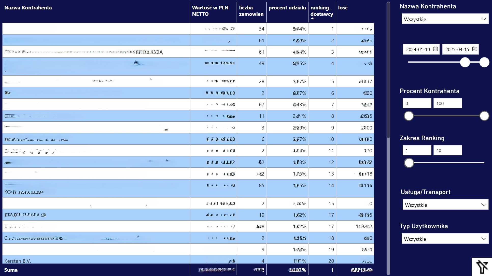
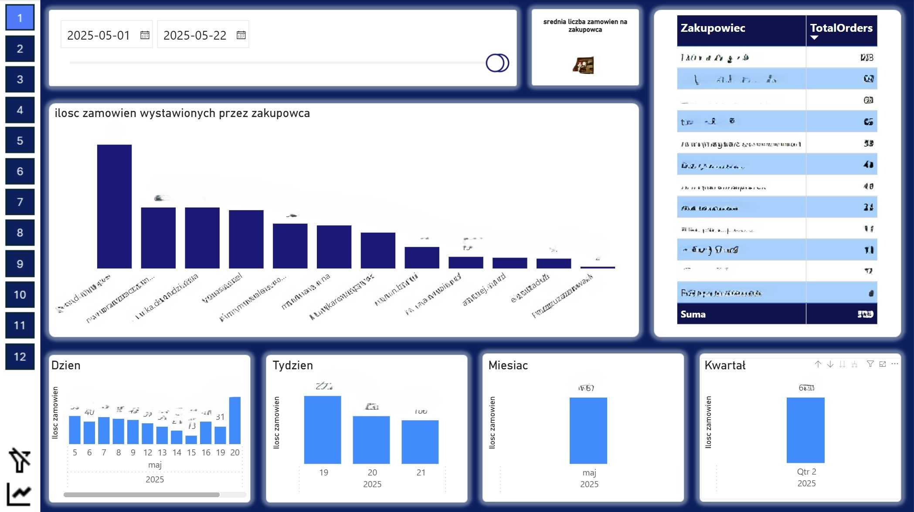
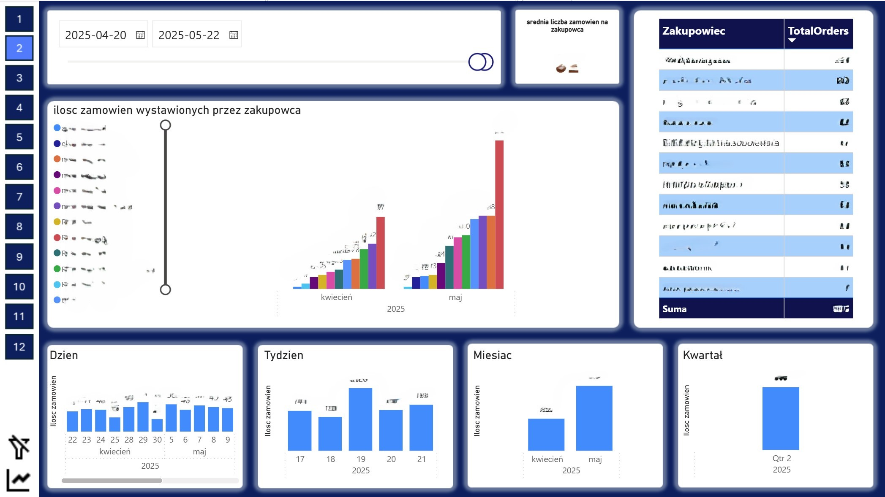
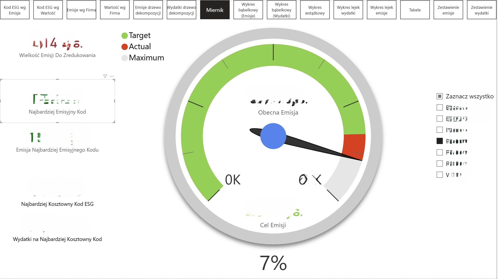

# Projekty Power BI

Zestaw dashboardów przygotowanych w Power BI, prezentujących analizę danych biznesowych, operacyjnych i środowiskowych.  
Każdy z raportów opiera się na autorskich miarach DAX oraz modelu danych opartym na relacjach i filtrach dynamicznych.

---

## 1️⃣ Analiza kontrahentów i zamówień
Dashboard przedstawiający ranking kontrahentów, liczbę i wartość zamówień oraz ich udział procentowy.  
Pozwala na filtrowanie danych po zakresie rankingu, typie usługi i użytkownika.  
Umożliwia szybkie porównanie aktywności dostawców oraz identyfikację kluczowych partnerów handlowych.

📊 **Zakres analizy:** Power BI, DAX, tabele dynamiczne, filtry interaktywne  

---

## 2️⃣ Analiza zamówień wystawionych przez zakupowców
Dashboard prezentujący liczbę zamówień wystawianych przez poszczególnych zakupowców w wybranym okresie.  
Pozwala śledzić aktywność zespołu zakupowego i identyfikować osoby o najwyższej skuteczności.

📊 **Zakres analizy:** Power BI, DAX, hierarchie czasu, analiza produktywności zespołu  

---

## 3️⃣ Aktywność zakupowców w czasie
Dashboard przedstawiający porównanie aktywności zakupowców w różnych okresach – dziennym, tygodniowym, miesięcznym i kwartalnym.  
Pozwala analizować trendy, sezonowość pracy oraz dynamikę zmian w liczbie zamówień.

📊 **Zakres analizy:** Power BI, DAX, analiza trendów, porównania okresowe  

---

## 4️⃣ Analiza emisji i wskaźników ESG
Dashboard opracowany na potrzeby monitorowania emisji i wskaźników ESG.  
Prezentuje aktualny poziom emisji względem celu redukcyjnego oraz najbardziej emisyjne i kosztowne kody ESG.  
Wskaźnik (gauge) pokazuje, w jakim stopniu firma zbliża się do realizacji założonego celu środowiskowego.

📊 **Zakres analizy:** Power BI, DAX, KPI, analiza danych ESG  

